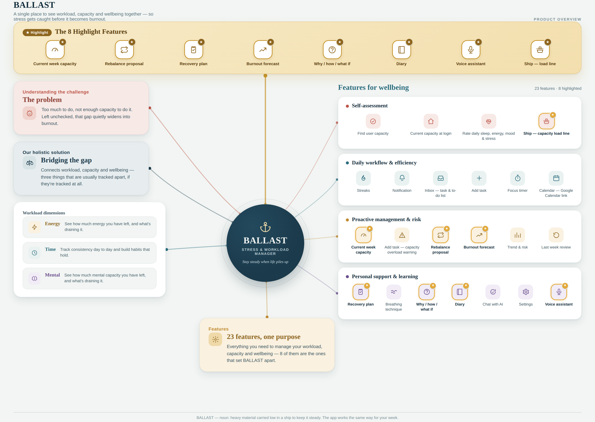

# Ballast by [Team Name]

**Team:** [Member 1], [Member 2], [Member 3], [Member 4]
**Problem Statement:** Stress & Workload Manager
**Video Presentation:** [Unlisted YouTube Link](#)
**Presentation Slides:** [Public Link](#)

---

# 1. Project Overview

## The Problem

University students often experience burnout not because of one overwhelming responsibility, but because multiple ordinary responsibilities accumulate at the same time.

Academic assignments, classes, part-time work, social commitments, physical fatigue, and daily errands compete for a student's limited capacity. However, existing productivity and wellbeing applications generally treat these problems separately.

The main causes we identified are:

1. **Students cannot see their total workload** — commitments are scattered across calendars, university portals, messaging applications, planners, and personal memory.
2. **Workload is not one-dimensional** — mental effort, time, physical energy, social obligations, and errands affect students differently.
3. **Student capacity changes from week to week** — poor sleep, low energy, low mood, and lack of rest can make the same workload feel much heavier.
4. **The cost of new commitments is unclear** — students may accept additional responsibilities without understanding what they will have to sacrifice.
5. **Replanning is difficult when already overwhelmed** — students often need to organise themselves before existing productivity tools can help them.
6. **Rest is easily sacrificed** — assignments and work have deadlines, while rest is often treated as optional.

The underlying problem is that **burnout builds up over time rather than appearing from a single stressful day**. Therefore, students need a system that considers both their workload and their changing capacity.

### Stakeholders

| Stakeholder                            | What is at stake                                                                                    |
| -------------------------------------- | --------------------------------------------------------------------------------------------------- |
| **University Students**                | Academic performance, wellbeing, physical energy, and ability to balance multiple responsibilities. |
| **University Counselling Services**    | Earlier awareness of students experiencing prolonged workload pressure.                             |
| **Lecturers & Programme Coordinators** | Better understanding of workload pressure before it affects attendance and submissions.             |
| **Student Employers**                  | More predictable availability and reduced impact from student burnout.                              |
| **Family & Friends**                   | Better awareness of changes in a student's workload and wellbeing.                                  |

### Existing Solutions

| Existing Solution    | What It Does Well                                                                        | Why It Falls Short                                                                                                          |
| -------------------- | ---------------------------------------------------------------------------------------- | --------------------------------------------------------------------------------------------------------------------------- |
| **Motion**           | Automatically schedules tasks based on deadlines, priorities, duration and availability. | Focuses on fitting work into the calendar rather than determining whether the workload fits the student's current capacity. |
| **Notion / Todoist** | Good for recording and organising tasks.                                                 | Counts tasks but does not measure how mentally or physically demanding those tasks are.                                     |
| **Google Calendar**  | Useful for classes, appointments and fixed commitments.                                  | Mainly understands time and does not account for fatigue, sleep or mental capacity.                                         |
| **Daylio / Finch**   | Makes mood and wellbeing tracking simple.                                                | Tracks how users feel but does not connect their feelings to the workload causing them.                                     |
| **Forest**           | Helps users focus during individual work sessions.                                       | Focuses on one session rather than the student's overall weekly workload.                                                   |
| **Headspace / Calm** | Provides meditation and relaxation content.                                              | Addresses the feeling of stress rather than the workload contributing to it.                                                |

### The Gap

Existing applications generally fall into two categories:

- **Productivity applications** understand what students have to do.
- **Wellbeing applications** understand how students feel.

However, they rarely connect **workload + personal capacity + wellbeing**.

**Ballast is designed to bridge this gap.**

---

## Our Solution

**Ballast** is a mobile Stress & Workload Manager designed to help university students understand how much they are carrying across different areas of their lives. Instead of measuring workload only through the number of tasks or available hours, Ballast considers five dimensions: **Thinking, Time, Body, People, and Errands**. The application combines commitments with short daily check-ins such as sleep, energy, mood and stress to estimate the student's current capacity. Ballast then helps students make better decisions by suggesting schedule changes, protecting rest, warning about the cost of new commitments, and forecasting where their workload is heading.

> **"The goal was never to carry nothing. It is to know how much you are carrying."**

### Core Feature Set

#### 📊 Workload Management

- Five workload dimensions:
  - Thinking
  - Time
  - Body
  - People
  - Errands

- Overall weekly workload percentage
- Individual workload scores
- Capacity adjustment based on sleep, energy, mood and rest
- Identification of the most overloaded area
- Workload trend tracking
- Rest owed calculation

#### 📝 Daily Check-In

- 15-second daily check-in
- Sleep tracking
- Energy tracking
- Mood tracking
- Stress tracking
- Mood and workload history
- Optional check-in streak

#### 📅 Smart Planning

- Quick task entry
- Morning / afternoon / evening planning
- Priority levels
- Automatic workload categorisation
- Task sizing: Small / Medium / Large
- "I keep putting this off" flag
- Errand grouping

#### 🔄 Workload Intervention

- **Rearrange My Week**
- Automatic schedule optimisation
- Move tasks to lighter days
- Group similar errands
- Delay lower-priority tasks
- Protect scheduled rest
- Explain the reason behind every suggested change

#### ⚠️ Commitment Warning

Before accepting a new commitment, Ballast shows the potential impact on the student's workload.

Example:

> **"This takes you from 104% to 119%. To fit it in, something needs to move."**

Users can choose:

- **Add anyway**
- **Add and rearrange my week**
- **Not now**

#### 🛌 Recovery

- Protected rest blocks
- Rest recommendations
- Focus timer
- Guided breathing
- Water reminders
- Sleep reminders
- Movement reminders
- Notification limits

#### 🤖 AI Assistant

- Add tasks using natural language
- Ask questions about personal workload
- Explain workload calculations
- Explain why a workload warning was triggered
- Help users understand changes between weeks
- Provide responses based on the application's calculated data

#### 🔮 Forecasting

- 14-day workload forecast
- Burnout-risk direction
- Future scenario comparison
- Weekly review
- Personal workload patterns
- Confidence levels for predictions

#### 🔍 Explainable Workload Calculation

Users can ask:

- **Why am I seeing this?**
- **How did you calculate this?**
- **What if I remove this task?**

Ballast provides the calculation and information behind the result instead of presenting an unexplained score.

---

# 2. Ideation & Process

## 2.1 Ideas We Considered

## 2.2 Ideation Boards

### Mindmap

The mindmap shows the different directions considered during ideation, including productivity, wellbeing, AI assistance, workload tracking and student lifestyle management.

### User Flow

The user flow demonstrates the intended journey from onboarding and workload assessment to planning, daily check-ins, workload analysis, intervention and weekly review.

## 2.3 Mentor Consultation

| **Date** | **Mentor**    | **Feedback Received** | **What Was Changed** |
| -------- | ------------- | --------------------- | -------------------- |
| [Date]   | [Mentor Name] | [Feedback]            | [Change made]        |
| [Date]   | [Mentor Name] | [Feedback]            | [Change made]        |
| [Date]   | [Mentor Name] | [Feedback]            | [Change made]        |

> **Note:** Include feedback even when the team decided not to follow it. Explain the reasoning behind the final decision.

---

# 3. Design & Prototype

# 5. Technical Architecture & Feasibility
